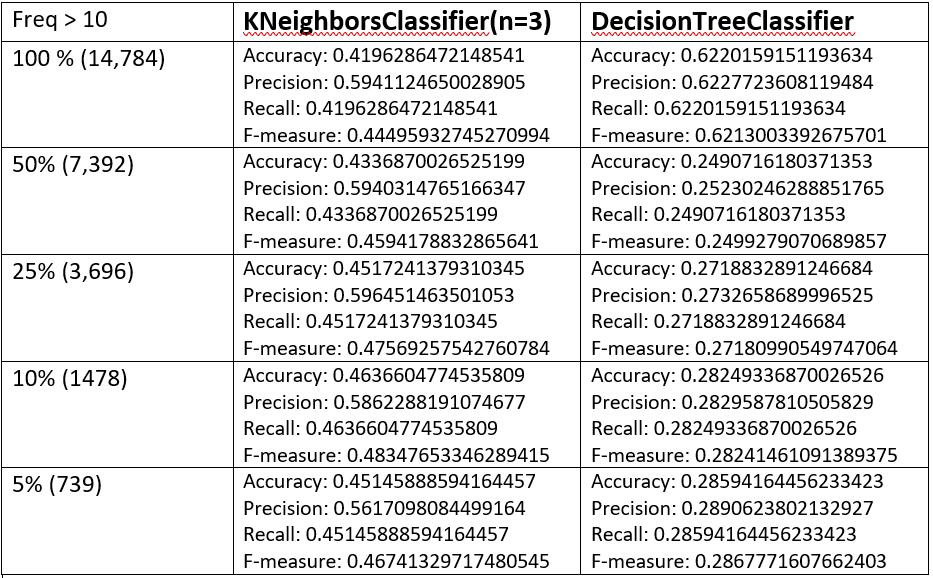

# LT2212 V20 Assignment 2

Put any documentation here including any answers to the questions in the 
assignment on Canvas.

## Part 1
For tokenization I just split the data on white space and filtered out words containing only alphabetic charaters. I also applied NLTK's stop word list and limited the vocabulary to the words occuring more than 10 times in the corpus. This latter step decreased the vocabulary from 67k words to the more manageable 14,784. 

## Part 2
I used truncated SVD for the dimensionality reduction. 

## Part 3
-m 1 = KNeighborsClassifier(n_neighbors=3) 
-m 2 = DecisionTreeClassifier()

## Part 4

 

[observations]
